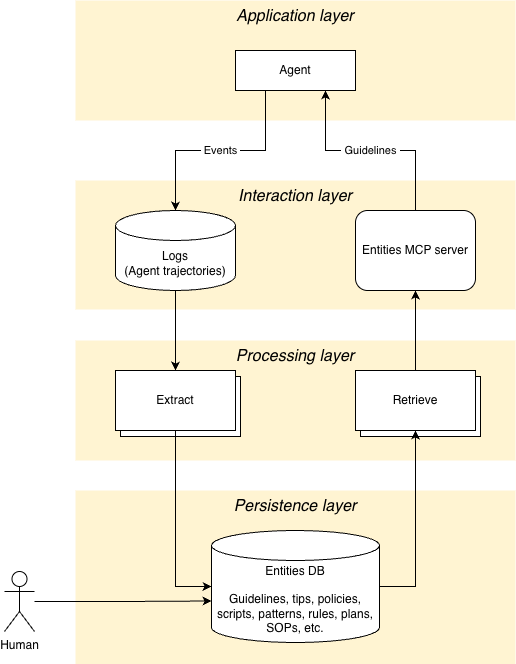

# Evolve
***_Self-improving agents through iterations._***

Coding agents repeat the same mistakes because they start fresh every session. Evolve gives agents memory — they learn from what worked and what didn't, so each session is better than the last.

On the AppWorld benchmark, Evolve improved agent reliability by **+8.9 points** overall, with a **74% relative increase** on hard multi-step tasks. See the [full results](results/index.md) and the [paper (arXiv:2603.10600)](https://arxiv.org/abs/2603.10600).

## Get Started

- [Installation](installation/index.md): Set up Evolve on Bob or Claude Code.
- [Hello World with IBM Bob](examples/hello_world/bob.md): A simple walkthrough that shows how memory gets learned.
- [Hello World with Claude Code](examples/hello_world/claude.md): Get started with Evolve Lite in Claude Code.

## Guides

- [Configuration](guides/configuration.md): Configure models, backends, and environment variables.
- [Low-Code Tracing](guides/low-code-tracing.md): Instrument agents with Phoenix and verify end-to-end tracing.
- [Phoenix Sync](guides/phoenix-sync.md): Pull trajectories from Phoenix and generate stored guidelines.
- [Extract Trajectories](guides/extract-trajectories.md): Export Phoenix traces into an OpenAI-style message format.

## Reference

- [CLI Reference](reference/cli.md): Manage namespaces, entities, and sync jobs from the command line.
- [Policies](reference/policies.md): Structured policy entities and how to retrieve them with MCP tools.

## How It Works

Evolve analyzes agent trajectories to extract guidelines and best practices, then recalls them in future sessions. It supports both a lightweight file-based mode (Evolve Lite) and a full mode backed by an MCP server with vector storage and LLM-based conflict resolution.

